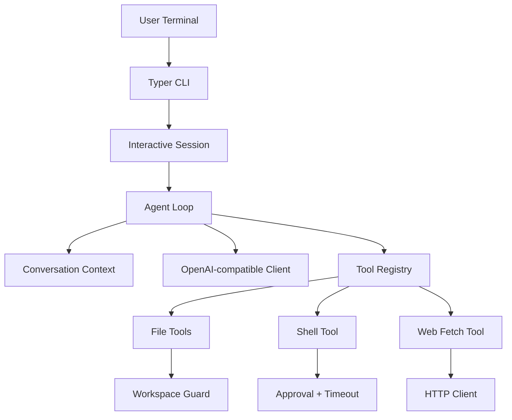

# asen cli

`asen cli` 是一个轻量级终端 AI 编程助手。它保留 Agent 循环、工具系统、安全边界和终端交互。

## 功能

- 交互式终端对话（`asen chat`）、Shell-heavy 会话（`asen shell`）和一次性任务执行（`asen ask`）
- 默认流式输出，支持 `--no-stream` 回退到一次性展示
- 交互会话支持 `!command` 直接执行 shell，结果可回填到 Agent 上下文
- 交互会话会自动保存到工作区 `.asen/sessions/`，支持 `asen session list` 和 `asen session resume`
- OpenAI-compatible LLM 调用
- JSON 工具调用协议：计划、最终回答、工具调用
- 文件读写、目录列表、Shell 命令执行、网页获取
- 工作区路径限制、危险命令拦截、命令超时、输出截断
- 配置管理（YAML / `.env` / 环境变量）

## 技术栈

- Python 3.11+
- `Typer`：CLI 命令入口
- `Rich`：终端展示和确认提示
- `prompt-toolkit`：交互式输入
- `Pydantic` + `PyYAML`：配置建模与校验
- `httpx`：OpenAI-compatible API 和网页请求
- `pytest` + `pytest-asyncio`：测试
- `ruff`：代码质量检查

## 架构



核心模块：`app.py` 负责 CLI 和 REPL，`core/agent.py` 负责 Agent 主循环，`core/llm.py` 负责模型调用，`tools/` 负责可执行工具，`utils/safety.py` 负责安全边界。

## 安装

```bash
cd asen-cli
python -m venv .venv
source .venv/bin/activate
pip install -e ".[dev]"
```

配置环境变量或创建 `.env`：

```bash
ASEN_API_KEY="sk-your-api-key"
ASEN_BASE_URL="https://api.openai.com/v1"
ASEN_MODEL="gpt-4o-mini"
```

也可以使用配置命令管理全局或项目配置：

```bash
asen config init --global
asen config set provider openai --global
asen config set model gpt-4o-mini --global
asen config init
asen config set base_url https://api.openai.com/v1
asen config get
```

配置优先级为：`.env` / 环境变量 < `~/.asen/config.yaml` < `.asen/config.yaml` < `--config` 指定文件 < CLI 显式参数。完整说明见 `docs/config_upgrade.md`。

## 使用

交互式会话：

```bash
asen chat --workspace examples/demo_project
```

Shell-heavy 会话：

```bash
asen shell --workspace examples/demo_project
```

查看当前工作区的历史会话：

```bash
asen session list --workspace examples/demo_project
```

恢复指定会话：

```bash
asen session resume 2026-05-21-160955-asen-cli --workspace examples/demo_project
```

查看当前工作区的历史 checkpoint：

```bash
asen checkpoint list --workspace examples/demo_project
```

查看某个 checkpoint 的 diff：

```bash
asen checkpoint diff 2026-05-21-170512-write-file --workspace examples/demo_project
```

恢复某个 checkpoint：

```bash
asen checkpoint restore 2026-05-21-170512-write-file --workspace examples/demo_project
```

一次性任务：

```bash
asen ask "读取 hello.py 并解释代码" --workspace examples/demo_project
```

禁用确认提示：

```bash
asen ask "运行 python hello.py" --workspace examples/demo_project --no-approval
```

交互模式支持 slash commands：`/help`、`/tools`、`/config`、`/clear`、`/paste`、`/exit`。

交互模式也支持 bang command：

```text
! ls
! pytest -q
! git status
```

### 会话持久化

每次 `asen chat` / `asen shell` 启动时，都会在当前 workspace 下创建一个新的 `.asen/sessions/<session_id>/` 目录：

```text
.asen/sessions/<session_id>/
├── events.jsonl
├── meta.json
└── summary.md
```

其中：

- `events.jsonl` 记录 `user_message`、`assistant_message`、`tool_call`、`shell_command`、`context_snapshot` 等事件
- `meta.json` 保存 `session_id`、`session_mode`、模型信息、更新时间、轮次、工具调用次数和摘要预览
- `summary.md` 保存最终修改摘要，或者最近一次回答的摘要

`asen session list` 会按最近更新时间倒序展示会话；`asen session resume <id>` 支持完整 `session_id`，也支持唯一前缀恢复。如果前缀命中多个会话，会直接报错，避免恢复到错误上下文。

开启详细执行日志：

```bash
asen chat --workspace examples/demo_project --verbose
```

关闭流式输出，回退到完整回答后再展示：

```bash
asen ask "解释 hello.py" --workspace examples/demo_project --no-stream
```

默认流式模式下，如果模型直接返回 `{"final": ...}`，终端会用 Rich Live 边生成边刷新；如果模型返回 `{"tool_calls": ...}` 或 `{"plan": ...}`，则不会把原始 JSON 流直接暴露给用户，而是在完整解析后切换到工具执行/计划展示。

## 工具协议

计划：

```json
{"plan": [{"id": "1", "content": "阅读项目结构"}, {"id": "2", "content": "修改代码并验证"}]}
```

最终回答：

```json
{"final": "解释或结论"}
```

工具调用：

```json
{"tool_calls": [{"name": "read_file", "arguments": {"path": "hello.py"}}]}
```

当前内置工具包括 `read_file`、`read_file_chunk`、`write_file`、`replace_in_file`、`apply_patch`、`list_files`、`find_files`、`search_text`、`grep_context`、`show_tree`、`read_many_files`、`shell`、`web_fetch`。

v0.7 起，新增上下文压缩能力：`ContextManager` 会按 token budget 组合 system、summary、facts、plan 和 recent messages，对旧消息做规则摘要，对大工具结果做压缩，并新增 `read_file_chunk` 支持大文件分段读取。完整说明见 `docs/context_compression_upgrade.md`。

v0.8 起，新增多层配置系统：支持 `~/.asen/config.yaml` 全局配置、`.asen/config.yaml` 项目配置，以及 `asen config init/get/set` 子命令。完整说明见 `docs/config_upgrade.md`。

v0.9 起，新增多模型 Provider：`openai`、`openai-compatible`、`deepseek`、`kimi`、`tongyi`、`zhipu` 走 OpenAI-compatible adapter，`ollama` 走本地 `/api/chat` adapter。完整说明见 `docs/provider_upgrade.md`。

v1.0 起，新增流式输出：CLI 默认走 provider 的 `stream_complete()`，`AsenConsole` 使用 Rich Live 渲染最终回答；`asen chat` / `asen ask` 支持 `--stream/--no-stream`。为了兼容当前 JSON 协议，Agent 只在增量识别到 `final` / `final_text` 字段时流式展示文本，遇到 `plan` / `tool_calls` 会先完成解析再进入后续执行。完整说明见 `docs/streaming_output_upgrade.md`。

## 安全设计

文件工具通过 `Path.resolve()` 校验路径必须在 workspace 内。Agent 侧的 `write_file` 和 `shell` 工具默认需要用户确认。手动 `!command` 模式则采用更轻量的 guard：普通命令直接执行，高风险命令确认，明显危险的命令直接阻断。Shell 相关能力会拦截 `sudo`、`rm -rf /`、`mkfs`、`dd of=/dev/...`、`shutdown` 和 fork bomb，并对 `git push/reset`、依赖安装、输出重定向、远程执行等命令做高风险确认。所有工具输出按配置截断，避免上下文爆炸。

## 测试

全量回归：

```bash
pytest
ruff check .
```

会话持久化相关回归：

```bash
pytest tests/test_session_store.py tests/test_session.py tests/test_streaming_cli.py tests/test_context_manager.py -q
```

Shell 模式与安全相关回归：

```bash
pytest tests/test_shell_mode.py tests/test_safety.py tests/test_tools_shell.py -q
```

测试覆盖配置加载、路径安全、工具行为、网页抓取 mock、Agent 工具调用循环、会话保存与恢复、checkpoint 捕获与回滚，以及 Shell 执行安全边界。
