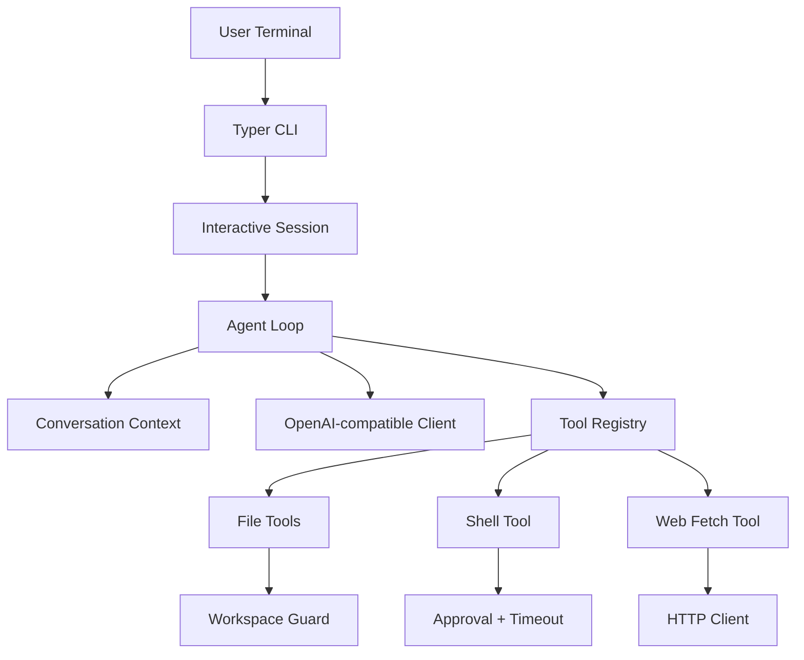

# asen cli

`asen cli` 是一个轻量级终端 AI 编程助手。它保留 Agent 循环、工具系统、安全边界和终端交互。

## 功能

- 交互式终端对话（`asen chat`）和一次性任务执行（`asen ask`）
- OpenAI-compatible LLM 调用
- JSON 工具调用协议：计划、最终回答、工具调用
- 文件读写、目录列表、Shell 命令执行、网页获取
- 工作区路径限制、危险命令拦截、命令超时、输出截断
- 配置管理（YAML / `.env` / 环境变量）

## 技术栈

- Python 3.11+
- `Typer`：CLI 命令入口
- `Rich`：终端展示和确认提示
- `prompt-toolkit`：交互式输入
- `Pydantic` + `PyYAML`：配置建模与校验
- `httpx`：OpenAI-compatible API 和网页请求
- `pytest` + `pytest-asyncio`：测试
- `ruff`：代码质量检查

## 架构



核心模块：`app.py` 负责 CLI 和 REPL，`core/agent.py` 负责 Agent 主循环，`core/llm.py` 负责模型调用，`tools/` 负责可执行工具，`utils/safety.py` 负责安全边界。

## 安装

```bash
cd asen-cli
python -m venv .venv
source .venv/bin/activate
pip install -e ".[dev]"
```

配置环境变量或创建 `.env`：

```bash
ASEN_API_KEY="sk-your-api-key"
ASEN_BASE_URL="https://api.openai.com/v1"
ASEN_MODEL="gpt-4o-mini"
```

## 使用

交互式会话：

```bash
asen chat --workspace examples/demo_project
```

一次性任务：

```bash
asen ask "读取 hello.py 并解释代码" --workspace examples/demo_project
```

禁用确认提示：

```bash
asen ask "运行 python hello.py" --workspace examples/demo_project --no-approval
```

交互模式支持 slash commands：`/help`、`/tools`、`/config`、`/clear`、`/paste`、`/exit`。

开启详细执行日志：

```bash
asen chat --workspace examples/demo_project --verbose
```

## 工具协议

计划：

```json
{"plan": [{"id": "1", "content": "阅读项目结构"}, {"id": "2", "content": "修改代码并验证"}]}
```

最终回答：

```json
{"final": "解释或结论"}
```

工具调用：

```json
{"tool_calls": [{"name": "read_file", "arguments": {"path": "hello.py"}}]}
```

当前内置工具包括 `read_file`、`read_file_chunk`、`write_file`、`replace_in_file`、`apply_patch`、`list_files`、`find_files`、`search_text`、`grep_context`、`show_tree`、`read_many_files`、`shell`、`web_fetch`。

v0.7 起，新增上下文压缩能力：`ContextManager` 会按 token budget 组合 system、summary、facts、plan 和 recent messages，对旧消息做规则摘要，对大工具结果做压缩，并新增 `read_file_chunk` 支持大文件分段读取。完整说明见 `docs/context_compression_upgrade.md`。

## 安全设计

文件工具通过 `Path.resolve()` 校验路径必须在 workspace 内。`write_file` 和 `shell` 默认需要用户确认。Shell 工具拦截明显危险的命令，例如 `sudo`、`rm -rf /`、`mkfs`、`dd of=/dev/...`、`shutdown` 和 fork bomb。所有工具输出按配置截断，避免上下文爆炸。

## 测试

```bash
pytest
ruff check .
```

测试覆盖配置加载、路径安全、工具行为、网页抓取 mock、Agent 工具调用循环和最大轮次保护。
